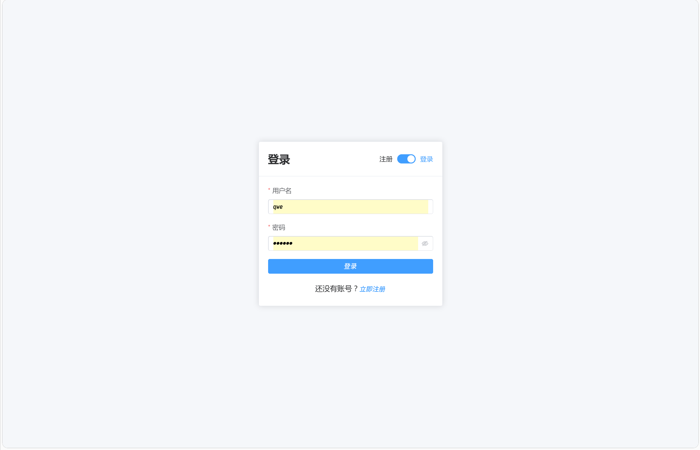
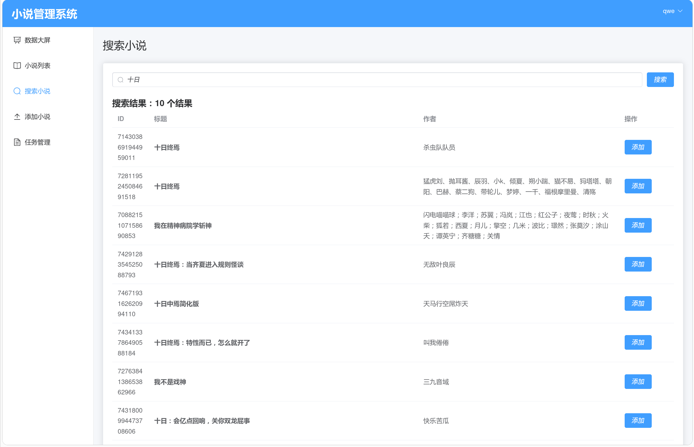
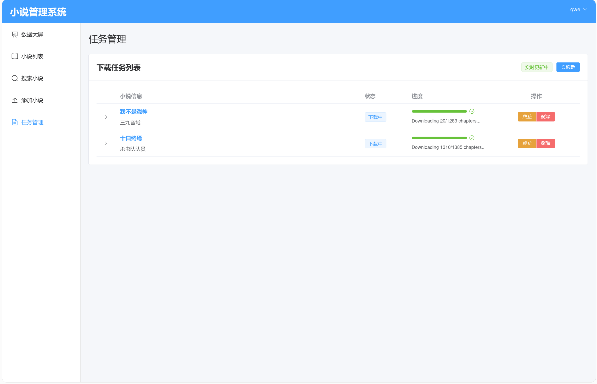
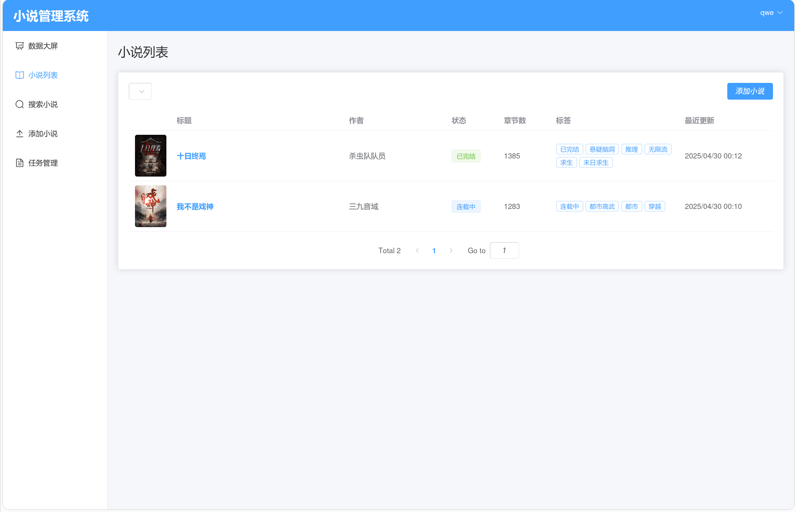
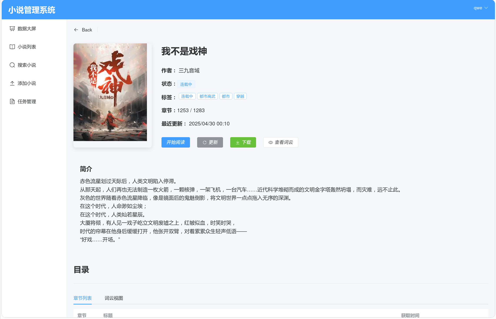
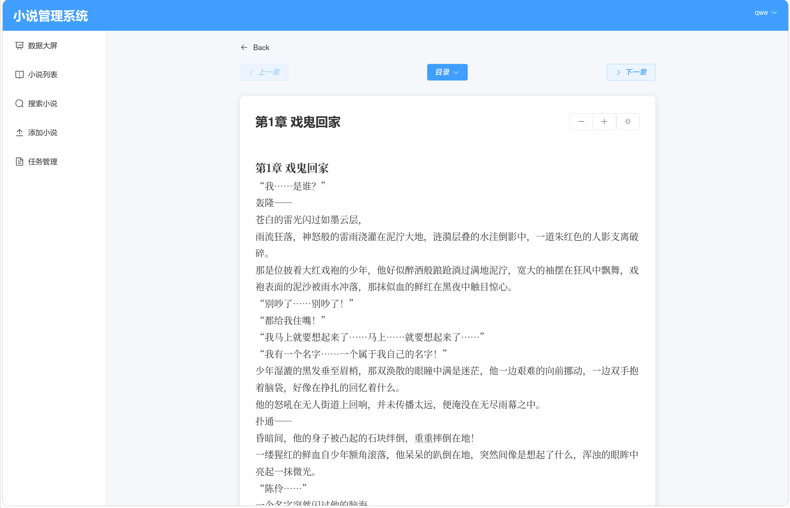
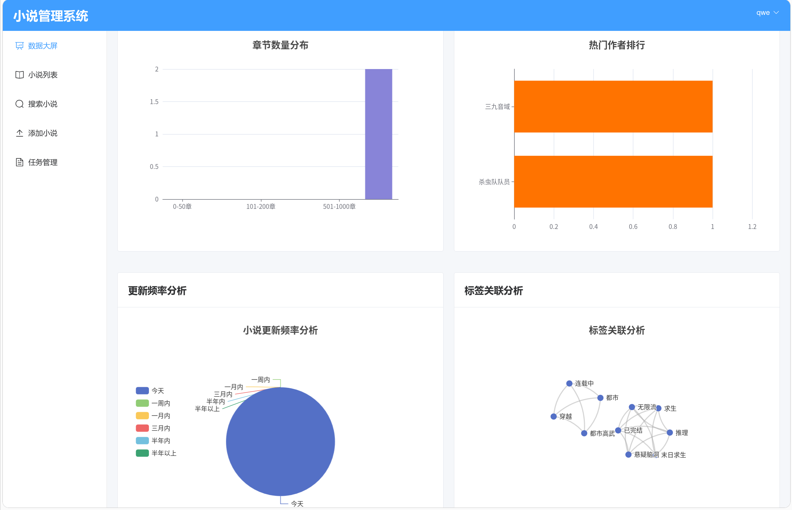

# Fanqie Reader - 番茄小说阅读器

一个用于可视化爬取、管理和阅读番茄小说的 Web 应用。它允许用户搜索番茄网的小说，将其加入下载队列，跟踪下载进度，在线阅读，并查看一些基本的统计信息。

---

## 系统架构详解

本系统采用前后端分离、基于容器化部署的分布式架构，主要由以下服务和模块构成：

### 1. 后端 (Backend - Flask API)

- **技术栈:** Python 3, Flask, Gunicorn, Eventlet, Flask-SQLAlchemy, Flask-JWT-Extended, Flask-SocketIO, Celery API。
- **功能:**
  - 作为核心 API 服务器 (`app.py`)，处理前端的所有 HTTP 请求。
  - **用户认证:** 使用 `auth.py` 蓝图处理用户注册和登录，通过 Flask-JWT-Extended 生成和验证 JWT。
  - **API 路由:** 定义 RESTful API 接口：
    - `/api/search`: 搜索小说。
    - `/api/novels`: 添加小说下载任务 / 获取小说列表。
    - `/api/novels/<id>`: 获取小说详细信息。
    - `/api/novels/<id>/chapters`: 获取章节列表。
    - `/api/novels/<id>/chapters/<cid>`: 获取特定章节内容。
    - `/api/novels/<id>/cover`: 获取封面。
    - `/api/novels/<id>/download`: 下载生成的小说文件。
    - `/api/tasks/*`: 管理下载任务。
    - `/api/stats/*`: 获取统计数据。
  - **数据库交互:** 通过 SQLAlchemy 操作 MySQL。
  - **任务调度:** 使用 Celery 向 Redis 发布任务。
  - **实时通信:** Flask-SocketIO + WebSocket 实时推送任务进度。
  - **异步处理:** Gunicorn + eventlet 支持并发。
  - **配置管理:** `config.py` 读取 `.env`。
  - **错误处理:** 全局异常捕获，返回标准化 JSON 错误。

### 2. 后台工作程序 (Celery Worker)

- **技术栈:** Python 3, Celery, Redis。
- **功能:**
  - 独立执行后台任务 (`process_novel_task`, `analyze_novel_task`)。
  - 下载章节、生成小说、统计词频、生成词云等。
  - 与 Flask-SocketIO 联动，更新任务状态。

### 3. 数据库 (MySQL)

- **技术栈:** MySQL 8。
- **数据模型:**
  - `User`: 用户信息。
  - `Novel`: 小说元数据。
  - `Chapter`: 小说章节内容。
  - `DownloadTask`: 下载任务信息。
  - `WordStat`: 词频统计数据。

### 4. 消息代理 / 缓存 (Redis)

- Celery 的消息中介与结果存储。
- Flask-SocketIO 的消息广播支撑。

### 5. 小说下载器模块 (`novel_downloader`)

- 实现对番茄小说官网或 API 的内容抓取。
- 多线程下载、断点恢复、章节加密解密。
- 使用 `ebooklib` 生成 EPUB，支持纯文本输出。
- 使用 `jieba` 分词 + `wordcloud` 生成词云图。

### 6. 前端 (Frontend - Vue)

- **技术栈:** Vue 3, Vite, Pinia, Vue Router, Axios, Socket.IO Client, Element Plus。
- **功能:**
  - 小说搜索 / 阅读 / 管理 / 下载任务可视化。
  - 实时进度同步（通过 WebSocket）。
  - 登录/注册状态管理。
  - 使用 Element Plus 提供 UI。

---

## 核心技术栈

- **前端:** Vue 3, Pinia, Vite, Element Plus
- **后端:** Flask, SQLAlchemy, Flask-JWT, Flask-SocketIO, Celery
- **任务调度:** Celery + Redis
- **数据库:** MySQL 8
- **部署:** Docker + Docker Compose

---

## 系统部署（详细说明）

### 先决条件

- Docker Engine
- Docker Compose v2+

### 步骤

1. 克隆项目代码。

2. 配置 `.env` 文件：

```dotenv
# 数据库
DB_NAME=fanqie_db
DB_USER=fanqie_user
DB_PASSWORD=数据库用户密码
DB_ROOT_PASSWORD=数据库root用户密码

# 安全密钥
JWT_SECRET_KEY=随机JWT密钥
FLASK_SECRET_KEY=随机Flask密钥

# Flask 环境
FLASK_ENV=production
FLASK_LOG_LEVEL=INFO
SQLALCHEMY_ECHO=False
TZ=Asia/Shanghai
```

3. 启动服务：

```bash
docker-compose up -d --build
```

4. 访问服务：

- 前端: `http://<服务器IP>:5173`
- 后端 API: `http://<服务器IP>:5000`（调试时）

5. 数据库连接：

- 地址：`localhost:3307`

---

## 功能展示与截图

- **用户认证:** 注册新用户，登录系统。  
  

- **小说搜索:** 输入关键词搜索小说。  
  

- **任务管理:** 查看下载任务列表、进度、状态。  
  

- **小说书架:** 展示成功下载的小说。  
  

- **小说详情:** 查看作者、简介、标签、章节等。  
  

- **在线阅读:** 查看已下载章节的内容。  
  

- **统计数据:** 展示上传、分类统计图表。  
  

- **词云图:** 后台生成小说词频图。  
  

---

## 日常维护

- 查看日志：

```bash
docker-compose logs -f backend
```

- 停止服务：

```bash
docker-compose down
```

- 重启服务：

```bash
docker-compose restart
```

- 更新代码：

```bash
git pull
docker-compose up -d --build
```